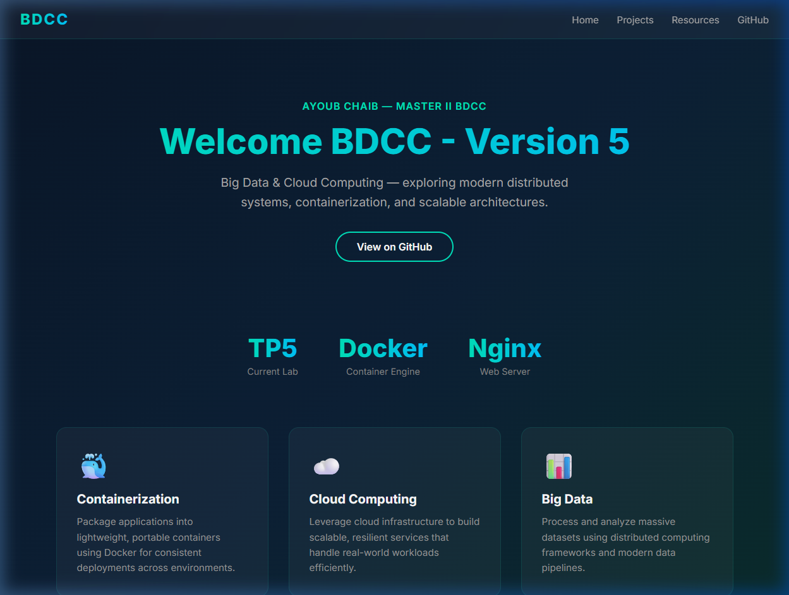
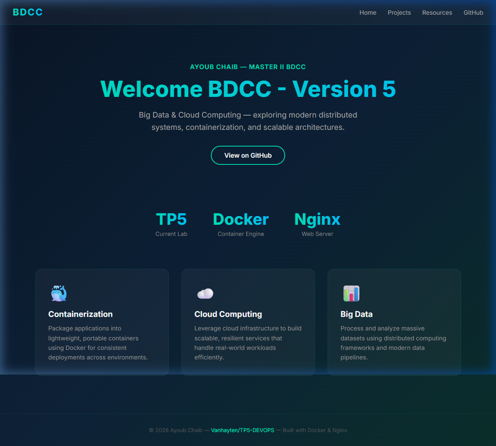
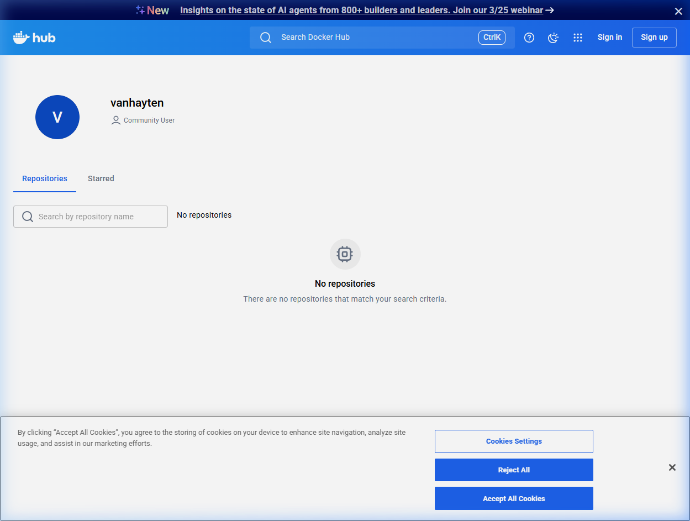
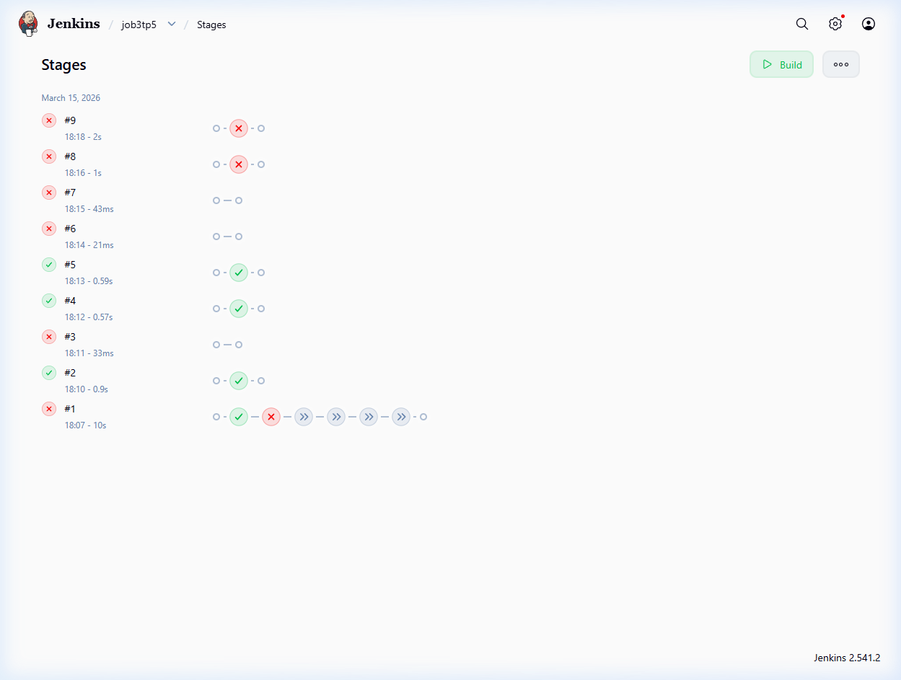

# TP5-DEVOPS

> **Master II BDCC** — Big Data et Cloud Computing
> **Author:** Ayoub Chaib
> **Lab:** TP5 — CI/CD Pipeline with Docker & Jenkins

---

## Description

This project demonstrates a complete **CI/CD pipeline** using **Jenkins** and **Docker**. A static web application served by **Nginx** is automatically built, tested, published to Docker Hub, and deployed — all triggered by source code changes on GitHub.

The lab covers four Jenkins job types, progressing from simple freestyle jobs to a full declarative pipeline reading a `Jenkinsfile` from SCM.

---

## Tech Stack

| Tool | Role |
|------|------|
| **Docker** | Containerization (Nginx web server) |
| **Jenkins** | CI/CD automation |
| **GitHub** | Source control |
| **Docker Hub** | Container image registry |

---

## Prerequisites

- Docker Desktop installed and running
- Jenkins installed (with Docker Pipeline and Git plugins)
- A Docker Hub account
- Jenkins credentials configured (`dockerhub-creds`) for Docker Hub authentication
- Git installed

---

## Project Structure

```
TP5-DEVOPS/
├── Dockerfile        # Builds an Nginx image with the custom index.html
├── Jenkinsfile       # Declarative pipeline definition
├── index.html        # Static web page (BDCC welcome page)
└── README.md
```

---

## How to Run

### Manually with Docker

```bash
# Build the image
docker build -t vanhayten/tp5 .

# Run the container
docker run -d --name tp5container -p 8081:80 vanhayten/tp5
```

Then open [http://localhost:8081](http://localhost:8081) in your browser.

### Via Jenkins Pipeline

1. Create a **Pipeline** job in Jenkins.
2. Under **Pipeline > Definition**, select **Pipeline script from SCM**.
3. Set the SCM to **Git** and enter the repository URL:
   `https://github.com/Vanhayten/TP5-DEVOPS.git`
4. Enable **Poll SCM** (e.g., `* * * * *`) for automatic build triggers.
5. Save and build.

---

## Pipeline Stages

The `Jenkinsfile` defines the following stages:

```
Cloning Git → Building Image → Test Image → Publish Image → Deploy Image
```

| Stage | Description |
|-------|-------------|
| **Cloning Git** | Clones the repository from GitHub |
| **Building Image** | Builds a Docker image tagged with the Jenkins build number |
| **Test Image** | Runs validation tests on the built image |
| **Publish Image** | Authenticates to Docker Hub and pushes the image |
| **Deploy Image** | Stops any existing container and deploys the new version on port `8081` |

Each build produces a uniquely tagged image (`vanhayten/tp5:<BUILD_NUMBER>`), enabling easy rollback and version tracking.

---

## Jenkins Jobs

Four jobs were created throughout this lab to demonstrate different Jenkins approaches:

| Job | Type | Description |
|-----|------|-------------|
| **job1tp5** | Freestyle | Basic CI job — build and test only |
| **job2tp5** | Freestyle | Full CI/CD — build, test, publish, and deploy |
| **job2tp5v2** | Pipeline (inline) | Same CI/CD flow using an inline pipeline script |
| **job3tp5** | Pipeline (SCM) | Reads the `Jenkinsfile` directly from the GitHub repository |

### Key Features

- **Poll SCM** — Automatically triggers builds when changes are pushed to GitHub.
- **Secure Credentials** — Docker Hub username/password stored in Jenkins credential store (`dockerhub-creds`), never exposed in logs.
- **Stage View** — Visual build history showing pass/fail status and duration for each stage.
- **Tagged Images** — Each build produces a unique Docker image tag for traceability.

---

## Screenshots

> Add screenshots of your Jenkins setup and pipeline runs below.

| Screenshot | Description |
|------------|-------------|
| Screenshot | Description |
|------------|-------------|
|  | Modernized header with Ayoub Chaib's identity |
|  | Full web application running on localhost:8081 |
|  | Docker Hub repository status |
|  | Jenkins Pipeline Stage View (Job job3tp5) |

---

## License

This project is developed for educational purposes as part of the **Master II BDCC** program.
